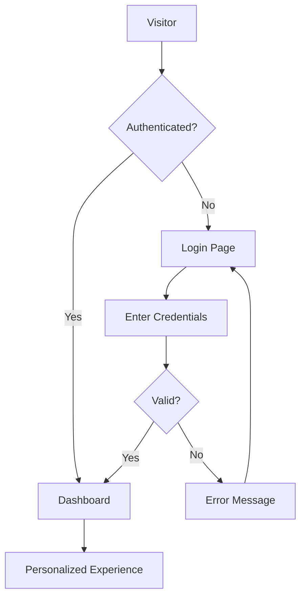

# 🔐 **DASHBOARD ACCESS STRATEGY & IMPLEMENTATION GUIDE**

## **CURRENT STATUS**

The personalized dashboard is fully implemented (`/dashboard` route) but currently has **NO ACCESS CONTROL**. Anyone can access it by navigating to `/dashboard` directly, but there's no navigation link or authentication system in place.

## **🎯 RECOMMENDED ACCESS IMPLEMENTATION STRATEGY**

### **PHASE 1: IMMEDIATE ACCESS (Quick Implementation)**

#### **Option A: Public Demo Access**
**Best for immediate testing and demonstration**

1. **Add Dashboard Link to Navigation**:
   ```tsx
   // In Navigation.tsx, add to navItems array:
   { name: "My Dashboard", href: "/dashboard" }
   ```

2. **Add Member Portal Section**:
   ```tsx
   // Add a dedicated "Member Portal" dropdown:
   {
     name: "Member Portal",
     href: "/dashboard",
     children: [
       { name: "Dashboard", href: "/dashboard" },
       { name: "My Profile", href: "/profile" },
       { name: "My Activities", href: "/dashboard#growth" },
       { name: "My Calendar", href: "/dashboard#calendar" }
     ]
   }
   ```

#### **Option B: Gated Access with Simple Authentication**
**Best for controlled member access**

1. **Create Simple Login Page**:
   ```tsx
   // src/pages/Login.tsx
   export default function Login() {
     return (
       <div className="min-h-screen flex items-center justify-center">
         <Card className="w-full max-w-md">
           <CardHeader>
             <CardTitle>Member Portal</CardTitle>
             <CardDescription>Sign in to access your dashboard</CardDescription>
           </CardHeader>
           <CardContent className="space-y-4">
             <Input placeholder="Email or Member ID" />
             <Input type="password" placeholder="Password" />
             <Button className="w-full">Sign In</Button>
           </CardContent>
         </Card>
       </div>
     );
   }
   ```

2. **Add Protected Route Logic**:
   ```tsx
   // src/components/ProtectedRoute.tsx
   export default function ProtectedRoute({ children }: { children: React.ReactNode }) {
     const isAuthenticated = localStorage.getItem('isAuthenticated') === 'true';
     
     if (!isAuthenticated) {
       return <Navigate to="/login" replace />;
     }
     
     return <>{children}</>;
   }
   ```

---

## **🚀 PHASE 2: COMPREHENSIVE AUTHENTICATION SYSTEM**

### **Professional Implementation Options**

#### **Option 1: Firebase Authentication**
**Recommended for quick, secure implementation**

```bash
npm install firebase
```

```tsx
// src/lib/firebase.ts
import { initializeApp } from 'firebase/app';
import { getAuth } from 'firebase/auth';

export const app = initializeApp({
  // Your Firebase config
});

export const auth = getAuth(app);
```

#### **Option 2: Auth0 Integration**
**Enterprise-grade authentication service**

```bash
npm install @auth0/auth0-react
```

#### **Option 3: Custom Backend Authentication**
**Full control with custom API**

```tsx
// src/hooks/useAuth.ts
export function useAuth() {
  const [user, setUser] = useState(null);
  const [isLoading, setIsLoading] = useState(true);
  
  const login = async (email: string, password: string) => {
    const response = await fetch('/api/auth/login', {
      method: 'POST',
      headers: { 'Content-Type': 'application/json' },
      body: JSON.stringify({ email, password })
    });
    // Handle authentication
  };
  
  return { user, login, logout, isLoading };
}
```

---

## **🎨 USER ACCESS INTERFACE DESIGN**

### **1. Navigation Enhancement**

Add a "Member Portal" section to the main navigation:

```tsx
// Enhanced Navigation with Dashboard Access
const navItems = [
  // ... existing items ...
  {
    name: "Member Portal",
    href: "/dashboard",
    icon: User,
    children: [
      { name: "Dashboard", href: "/dashboard", icon: LayoutDashboard },
      { name: "My Profile", href: "/profile", icon: User },
      { name: "Spiritual Growth", href: "/dashboard?tab=growth", icon: TrendingUp },
      { name: "My Calendar", href: "/dashboard?tab=calendar", icon: Calendar },
      { name: "Community", href: "/dashboard?tab=community", icon: Users },
      { name: "Settings", href: "/settings", icon: Settings }
    ]
  }
];
```

### **2. Member Login Button**

Add to the navigation bar:

```tsx
// In Navigation.tsx, add after "Watch Live" button:
<div className="flex items-center gap-2">
  <Link to="/live">
    <Button variant="church" size="lg">Watch Live</Button>
  </Link>
  <Link to="/login">
    <Button variant="outline" size="lg">
      <User className="h-4 w-4 mr-2" />
      Member Login
    </Button>
  </Link>
</div>
```

### **3. Dashboard Access Flow**



---

## **📱 MULTIPLE ACCESS METHODS**

### **Method 1: Direct URL Access**
- Current: `yourchurch.com/dashboard`
- With auth: Redirects to login if not authenticated

### **Method 2: Navigation Menu**
```tsx
// Desktop: Member Portal dropdown
// Mobile: Member Portal section in mobile menu
```

### **Method 3: Quick Access Widget**
```tsx
// Home page CTA section:
<section className="py-16 bg-primary/5">
  <div className="container mx-auto px-4 text-center">
    <h2 className="text-3xl font-bold mb-4">Member Portal</h2>
    <p className="text-lg mb-8">Access your personalized dashboard</p>
    <Button size="lg" asChild>
      <Link to="/dashboard">Go to Dashboard</Link>
    </Button>
  </div>
</section>
```

### **Method 4: QR Code Access**
For bulletin and physical materials:
```
Generate QR code linking to: yourchurch.com/dashboard
```

---

## **🛡️ SECURITY CONSIDERATIONS**

### **Data Protection**
```tsx
// Implement data privacy controls
const ProtectedDashboard = () => {
  const { user, permissions } = useAuth();
  
  return (
    <Dashboard
      userId={user?.id}
      permissions={permissions}
      dataPrivacy={{
        shareProgress: user?.preferences?.shareProgress ?? false,
        showActivity: user?.preferences?.showActivity ?? true
      }}
    />
  );
};
```

### **Session Management**
```tsx
// Auto-logout after inactivity
useEffect(() => {
  const timer = setTimeout(() => {
    if (isIdle) logout();
  }, 30 * 60 * 1000); // 30 minutes
  
  return () => clearTimeout(timer);
}, [activity]);
```

---

## **⚡ IMMEDIATE IMPLEMENTATION (15 minutes)**

### **Step 1: Add Navigation Link**

```tsx
// src/components/layout/Navigation.tsx
// Add this to the navItems array:
{ name: "Member Dashboard", href: "/dashboard" }
```

### **Step 2: Add Member Access Button**

```tsx
// After the "Watch Live" button:
<Link to="/dashboard" className="ml-2">
  <Button variant="outline" size="lg">
    <User className="h-4 w-4 mr-2" />
    Member Portal
  </Button>
</Link>
```

### **Step 3: Add Dashboard Route Protection (Optional)**

```tsx
// src/App.tsx - Modify the dashboard route:
<Route 
  path="dashboard" 
  element={
    <ProtectedRoute>
      <Dashboard />
    </ProtectedRoute>
  } 
/>
```

---

## **🎯 RECOMMENDED IMPLEMENTATION PATH**

### **For Immediate Demo/Testing:**
1. **Add navigation link** (5 minutes)
2. **Add member portal button** (5 minutes)
3. **Test dashboard access** (5 minutes)

### **For Production Deployment:**
1. **Implement authentication system** (Firebase/Auth0)
2. **Add user management** (registration, profiles)
3. **Add role-based access** (member, admin, visitor)
4. **Implement data privacy controls**
5. **Add session management**

### **For Enhanced User Experience:**
1. **Add onboarding flow** for new users
2. **Implement progressive web app** features
3. **Add mobile app integration**
4. **Create member QR codes** for easy access

---

## **📋 ACCESS METHODS SUMMARY**

| Method | Implementation Time | Security Level | User Experience |
|--------|-------------------|----------------|-----------------|
| **Direct Navigation Link** | 5 minutes | Low | Simple |
| **Simple Password Gate** | 30 minutes | Medium | Basic |
| **Firebase Auth** | 2 hours | High | Professional |
| **Custom Backend Auth** | 1-2 days | Very High | Customizable |

---

## **🎉 NEXT STEPS**

1. **Choose implementation approach** based on your timeline and security needs
2. **Add dashboard access** to navigation (immediate)
3. **Implement authentication** (if needed)
4. **Test user flow** from login to dashboard
5. **Add member onboarding** and documentation

**The dashboard is ready for user access - you just need to choose how users will authenticate and navigate to it!**